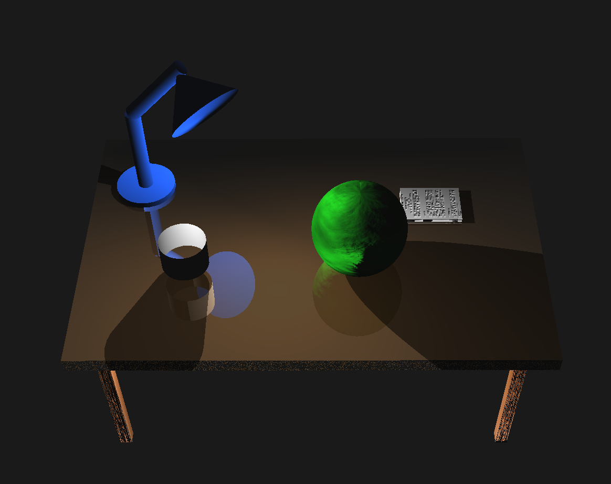
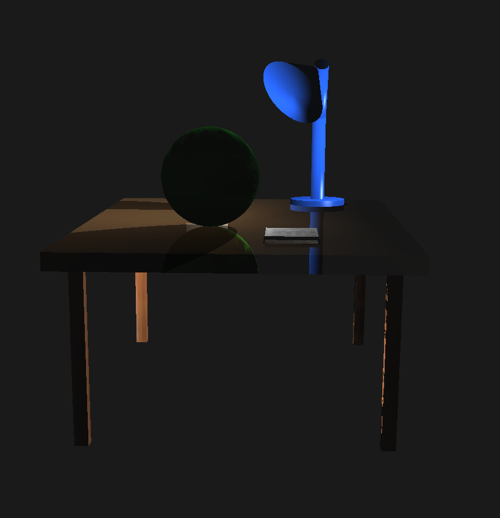

# Projeto Final - Relatório

**Disciplina:** INF1761 – Computação Gráfica **Professor:** Waldemar Celes
**Aluno:** Felipe Khouri Gameleira (2011265) **Período:** 2025.2

---

## Descrição do Projeto

Neste projeto final, implementei uma cena 3D interativa com uma mesa e objetos
sobre ela, utilizando o framework de grafo de cena fornecido pelo professor. O
objetivo foi criar uma cena realista com diversos efeitos gráficos avançados:

- Iluminação Phong por fragmento (fragment shader)
- Efeito de fog (neblina por distância)
- Mapeamento de texturas (madeira, papel)
- Bump mapping para simular rugosidade
- **Sombras planares** projetadas na superfície da mesa
- **Reflexão planar** na superfície semi-transparente da mesa
- Câmera interativa com arcball
- Geometrias procedurais (cilindro e cone)

---

## Cena Implementada

### Objetos Renderizados

| Objeto            | Tipo              | Material       | Textura          | Observações                     |
| ----------------- | ----------------- | -------------- | ---------------- | ------------------------------- |
| Mesa (tampo)      | Cubo achatado     | Marrom (α=0.3) | —                | Semi-transparente para reflexão |
| Mesa (pernas)     | 4 Cubos finos     | Madeira        | wood.jpg         | Suporte estrutural              |
| Papel             | Cubo fino         | Branco         | paper.jpg        | Sobre a mesa                    |
| Xícara            | Cilindro oco      | Cinza          | —                | Sem tampa superior              |
| Esfera verde      | Esfera            | Verde          | noise.png (bump) | Rugosidade simulada             |
| Luminária base    | Cilindro achatado | Azul           | —                | Apoio da lâmpada                |
| Luminária haste 1 | Cilindro fino     | Azul           | —                | Vertical                        |
| Luminária haste 2 | Cilindro fino     | Azul           | —                | Inclinada 45°                   |
| Luminária cabeça  | Cone              | Azul           | —                | Inclinado, visível por dentro   |

---

## Arquitetura Técnica

### Estrutura de Diretórios

```
trabalho_final/
├── main.py                 # Programa principal com pipeline de renderização
├── cone.py                 # Classe Cone (geometria procedural)
├── cylinder.py             # Classe Cylinder (geometria procedural)
├── shadows.py              # Matriz de projeção de sombras
├── README.md               # Este arquivo
├── shaders/
│   ├── phong.vert          # Vertex shader (Phong + texturas + bump)
│   ├── phong.frag          # Fragment shader (Phong + fog + bump mapping)
│   ├── shadow.vert         # Vertex shader para sombras
│   └── shadow.frag         # Fragment shader para sombras (cor escura)
├── texturas/
│   ├── wood.jpg            # Textura de madeira (pernas da mesa)
│   ├── paper.jpg           # Textura de papel
│   └── noise.png           # Mapa de rugosidade (bump map)
└── prints/                 # Screenshots da cena
```

### Classes Principais

#### Cone (`cone.py`)

Classe para gerar geometria de cone proceduralmente:

- Parâmetros: `nslices` (subdivisões radiais), `with_base` (tampa inferior),
  `disable_culling` (renderiza dois lados)
- O vértice fica em +Y, a base em Y=0, raio=1
- Normais e coordenadas de textura calculadas corretamente

#### Cylinder (`cylinder.py`)

Cilindro procedural com:

- Parâmetros: `nslices`, `nstacks` (subdivisões verticais), `with_caps`
  (tampas), `disable_culling`
- Base em Y=0, topo em Y=1, raio=1
- Mapeamento cilíndrico de texturas

#### Shadows (`shadows.py`)

Implementação da matriz de projeção de sombras planares:

```python
def get_shadow_matrix(light_pos, plane_y=0.0):
    """
    Retorna a matriz de projeção de sombra para uma luz em light_pos
    projetando no plano Y=plane_y.
    """
    # Translada para Y=0, aplica projeção, translada de volta
    T_down = glm.translate(glm.mat4(1.0), glm.vec3(0, -plane_y, 0))
    T_up = glm.translate(glm.mat4(1.0), glm.vec3(0, plane_y, 0))
    return T_up * shadow_y0 * T_down
```

---

## Recursos Implementados

### 1. Iluminação Phong por Fragmento

Implementei o modelo de Phong no fragment shader:

```glsl
// phong.frag - Modelo de iluminação
vec3 N = normalize(neye);
vec3 L = normalize(light);
vec3 V = normalize(-veye);
vec3 R = reflect(-L, N);

// Componentes de iluminação
vec4 color = mamb*lamb + mdif*ldif*max(dot(N,L), 0.0);
if (dot(N,L) > 0.0)
    color += mspe*lspe*pow(max(dot(R,V), 0.0), mshi);
```

### 2. Sombras Planares (Planar Shadows)

As sombras são projetadas na superfície da mesa (Y=1.1) usando uma matriz de
projeção:

- A matriz `shadow_y0` projeta geometria no plano Y=0
- Para projetar em Y=1.1, aplico translações antes e depois
- O stencil buffer evita "double-darkening" (sombras sobrepostas escurecendo
  demais)
- Polygon offset evita z-fighting entre sombra e mesa

```python
# Pipeline de sombras
glStencilFunc(GL_EQUAL, 1, 0xFF)
glStencilOp(GL_KEEP, GL_KEEP, GL_INCR)  # Incrementa para evitar double-darkening
glEnable(GL_POLYGON_OFFSET_FILL)
glPolygonOffset(-1.0, -1.0)
node_shadow_table.Render(st)
```

### 3. Reflexão Planar (Planar Reflection)

A reflexão é criada espelhando os objetos em relação ao plano da mesa:

- Transformação: `Translate(0, 2.2, 0) * Scale(1, -1, 1)` espelha em Y=1.1
- O stencil buffer limita a reflexão à área da mesa
- Culling é invertido para geometria espelhada
- A mesa é desenhada semi-transparente (α=0.3) sobre a reflexão

```python
# Transformação de reflexão
trf_reflection = Transform()
trf_reflection.Translate(0.0, 2.2, 0.0)   # Move up by 2*1.1
trf_reflection.Scale(1.0, -1.0, 1.0)      # Mirror
```

### 4. Pipeline de Renderização Multi-Pass

A ordem de renderização é crucial para efeitos de transparência e oclusão:

1. **Stencil Pass**: Marca área da mesa no stencil buffer
2. **Reflection Pass**: Desenha objetos espelhados onde stencil=1
3. **Table Top Pass**: Desenha mesa semi-transparente com blending (escreve no
   depth buffer)
4. **Shadow Pass**: Desenha sombras onde stencil=1
5. **Table Legs Pass**: Desenha pernas opacas (ocluídas pela mesa devido ao
   depth buffer)
6. **Objects Pass**: Desenha objetos opacos sobre a mesa

> **Nota**: As pernas são desenhadas _após_ a mesa para que fiquem ocultas
> quando vistas de cima, já que o tampo da mesa escreve no depth buffer
> primeiro.

### 5. Efeito de Fog (Neblina)

Fog exponencial implementado no fragment shader:

```glsl
if (useFog) {
    float dist = length(veye);
    float fogFactor = exp(-0.3 * dist);
    fogFactor = clamp(fogFactor, 0.0, 1.0);
    color.rgb = mix(fogColor, color.rgb, fogFactor);
}
```

### 6. Bump Mapping (Rugosidade)

Perturbação de normais usando derivadas parciais:

```glsl
if (useBump) {
    float h = texture(bumpTex, ftexcoord).r;
    float scale = 0.05;
    vec3 dpdx = dFdx(vec3(ftexcoord, h * scale));
    vec3 dpdy = dFdy(vec3(ftexcoord, h * scale));
    vec3 normalBump = normalize(cross(dpdx, dpdy));
    N = normalize(mix(N, normalBump, 0.5));
}
```

---

## Como Executar

```bash
cd trabalho_final
conda run -n comp_graf python main.py
```

---

## Controles

- **Mouse (arraste)**: Rotaciona a cena (arcball)
- **ESC**: Fecha a aplicação

---

## Configuração da Iluminação

```python
light = Light(0.65, 1.7, 0.3, 1.0, "world")
light.SetAmbient(0.05, 0.05, 0.05)      # Ambiente mínimo
light.SetDiffuse(2.5, 2.5, 2.5)         # Difusa forte
light.SetSpecular(1.0, 1.0, 1.0)        # Especular normal
```

A luz está posicionada próxima à cabeça da luminária, criando sombras realistas
dos objetos na mesa.

---

## Desafios Técnicos

### Reflexão Planar

O maior desafio foi fazer a reflexão funcionar corretamente. O problema era que:

1. A reflexão era renderizada, mas não visível de cima
2. O alpha do material não estava sendo passado corretamente para o shader
3. A ordem de renderização afetava a visibilidade

**Solução:**

- Configurar explicitamente `SetDiffuse()` com alpha para o shader usar `mdif.a`
- Usar stencil buffer para limitar reflexão à área da mesa
- Ordenar passes: reflexão → objetos opacos → mesa transparente

### Double-Darkening de Sombras

Sombras sobrepostas ficavam mais escuras que o esperado.

**Solução:** Usar `GL_INCR` no stencil para que cada pixel só receba sombra uma
vez.

### Z-Fighting

A sombra "brigava" com a superfície da mesa.

**Solução:** `glPolygonOffset(-1.0, -1.0)` desloca ligeiramente a sombra.

---

## Screenshots

As capturas de tela da cena estão na pasta `prints/`.





